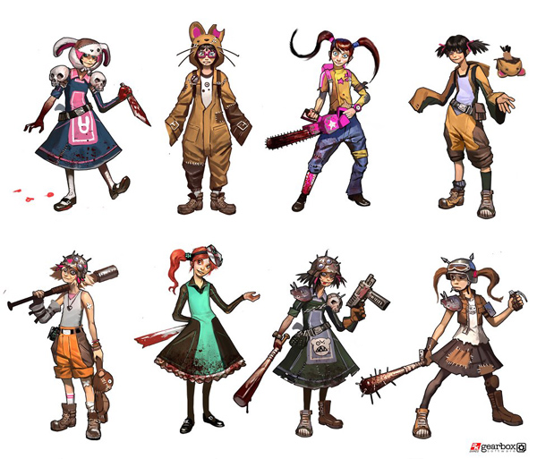
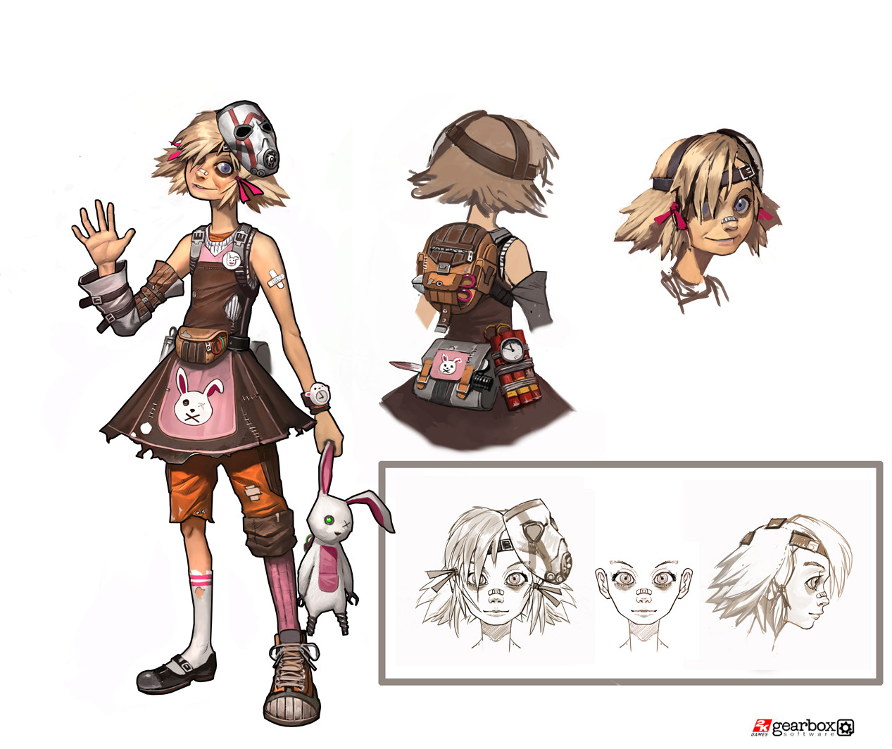
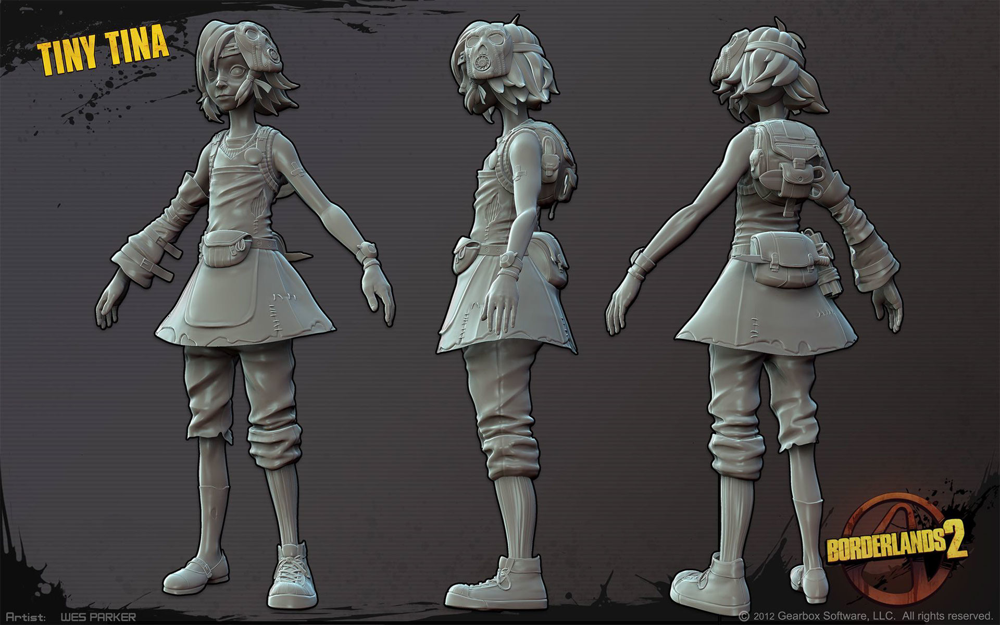
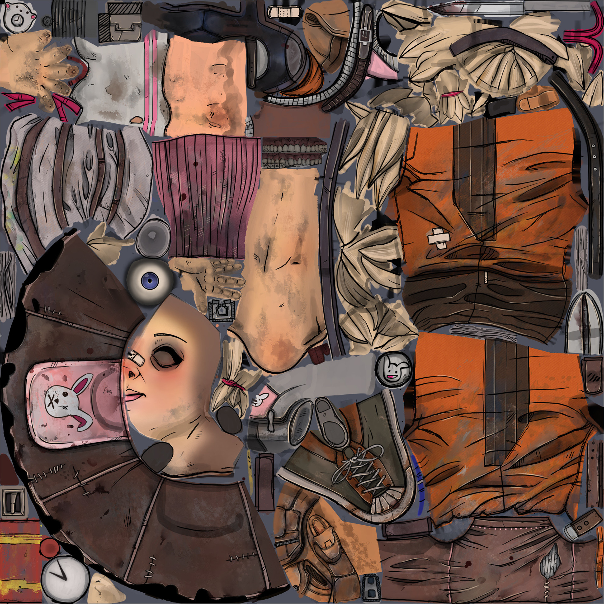
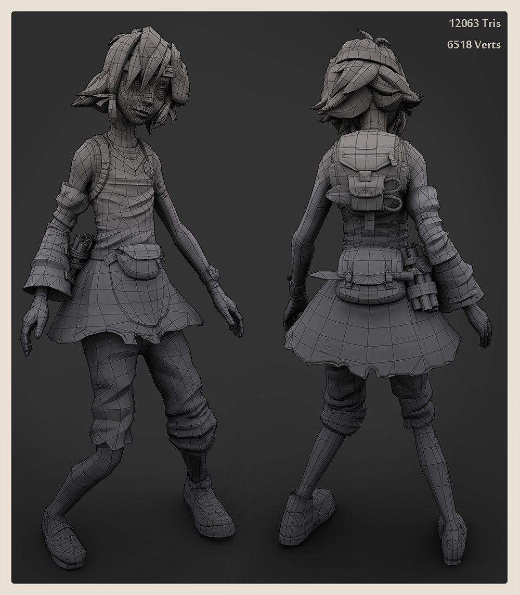
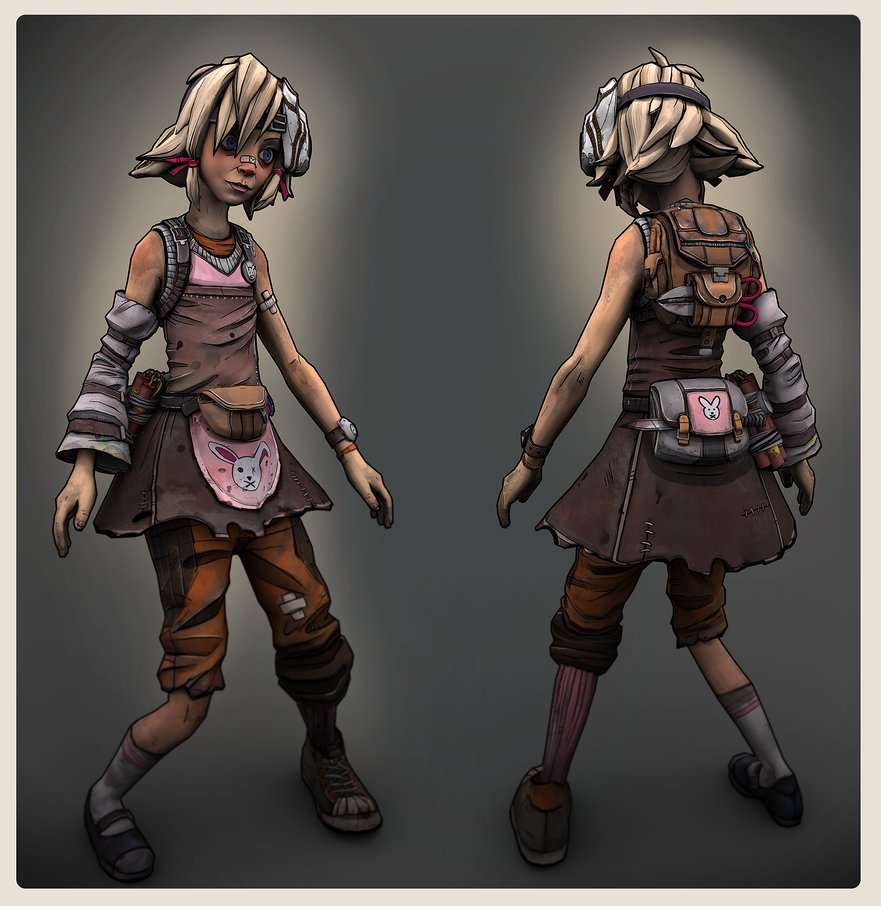

# Term Assignment
# Business Plan and Pitch Deck Development and Presentation
The term project for ENTR467/667 requires a stepped development of a viable business plan and an in-person  pitch  for  investment.    This  project  may  be  done  individually  or  in  pairs  at  your  discretion.    You have the freedom to consider any kind of realistic business opportunity, but keep in mind that rigorous exploration is required.

## Opportunity Proposal

Please provide me with a one- or two-page description of the business opportunity which you intend to pursue for the purposes of this assignment.

---

Right now, game development is [hard](https://en.wikipedia.org/wiki/List_of_commercial_failures_in_video_gaming) and [expensive](https://kotaku.com/why-video-games-cost-so-much-to-make-1818508211). [High-end AAA games are more and more costly to produce every year](https://en.wikipedia.org/wiki/List_of_most_expensive_video_games_to_develop), and 3D assets alone can take hundreds of man-hours to design and produce, not to mention actually programming them to work in whatever engine you happen to be using. Typically, you use unique assets in any given game to give it an individual feel, and while the rise of assets stores and free-until-you-make-money game engines has greatly lowered the cost of game development to the point of causing the '[indiepocalypse](http://molleindustria.org/indiepocalypse/)', games made by smaller teams still tend to struggle due to dependence on pre-made assets and animations. This can quickly get your game labeled as an "asset flip", which has its own connotations implying low quality, regardless of whether or not that's actually the case.

In particular, one piece of the game development process is character modeling. Typically you'll begin with concept art, where you'll have an artist generate a handful of different designs to feel out the character, who they are, what the look like, what their role is in your game's world.

*Initial concept art for Borderlands 2's Tiny Tina via [Wes Parker](https://www.artstation.com/artwork/JPded) and [Concept Art World](http://conceptartworld.com/books/the-art-of-borderlands-2/)*

*Final concept art*

From there, you'll hand off the finished 2D drawing to a 3D artist who will create a 3D model for this character for use in your game. The includes making the mesh and working with geometry, in addition to texturing

*High poly model*

*Model texture*

After they've been modeled, they have to be rigged, which can be another artist's work, and after rigging comes animation which can be yet another still. Animation as a piece in particular will sometimes take advantage of mocap solutions, but either way these models, animations, and textures all need to be cleaned and optimized for games as they run in real-time, and are increasingly shooting for a 90 FPS minimum particularly in the VR space.

*Low poly model*

*Final model*

For more information about the character creation pipeline, take a look at "[Overwatch: How A Hero is Mei'd](https://www.youtube.com/watch?v=lHevkQIZL2M)" by Blizzard's David Gibson.

We're also at a fascinating point in history in regards to technology. Spatial computing devices such as VR/AR headsets are becoming cost effective enough to reach homes; current tech alone has huge potential for amateur, but customized animations, 3D models, and other assets that [some people are already exploring](http://www.xrartisttoolkit.com/). Machine learning and AI applications are simultaneously terrifying in their use for [deepfakes](https://howtogeneratealmostanything.com/deepfakes/2018/10/30/episode7.html), but astounding in their applications towards [generative art](https://giant.gfycat.com/DeliriousRigidAzurevase.webm), [fashion](https://howtogeneratealmostanything.com/), and even [celebrities](https://github.com/tkarras/progressive_growing_of_gans).

I believe using this technology, we can enable smaller teams to develop their games with less time, effort, and funding than current game development practices. More specifically, the opportunity here is commercializing neural networks (ML/AI) in order to assist and automate the character creation pipeline.

Currently, there are a few other tools and middleware in the game development pipeline. One of these is [Spine](https://esotericsoftware.com/spine-purchase), a 2D character animation tool kickstarted in 2013. Another is [Wwise](https://www.audiokinetic.com/products/wwise/)

---

## Commentary on Founder’s Dilemmas

In a few pages, carefully consider the following three questions when it comes to your opportunity:

* When to found?  
* What kind of team?  
* What kind of financing?  

Provide well-thought out answers which show an understanding of the potential pitfalls of your answers when it comes to the unique opportunity that you are looking to explore.  

### When to found?

After (during?) I get my PhD and have more experience developing with this kind of tech. Admittedly, while I think all of this tech is super fascinating and has lots of applications, I don't thoroughly know how to use it yet! On top of that, hiring another person who is an expert is expensive, because the field is new and the skillset is niche.

### What kind of team?

???

### What kind of financing?

The sustainable kind that lets me as a person maintain autonomy and live comfortably. (NOT VC.) Crowdfunding? Well-off grandparents? Combinations therein?

---

## Pro Forma Financial Statement Development

Develop at least three years of financial statement projections along with a cash flow model.  Adequate supporting documentation is expected to outline assumptions and demonstrate an understanding of the components of both revenues and costs.

## Business Plan Development (Required: At least two days before your presentation)

Pull all of your analysis together into a comprehensive business plan which introduces the opportunity, outlines the strategy(ies) to be employed, and projects the gains to be realized.  Length can vary, but 5-10 pages of text would likely suffice plus supporting financials.

## Pitch Deck Presentation (Required: By Last Day of Exams)

Craft and deliver a 10- to 15-minute presentation appropriate for seeking prospective angel investment.  Upon conclusion, you will have to be prepared to answer questions for up to twenty minutes afterwards.  Several different windows for presentations will be available during the last couple weeks of the semester.
